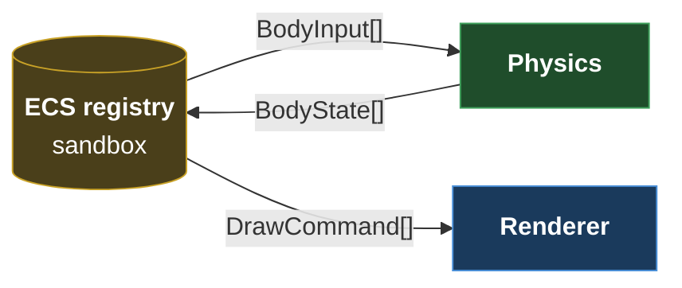

# NPE
NPE (Newton Physics Engine), a 2D physics engine written in C++23.

## Architecture

The engine is split into two independent static libraries, orchestrated by a client
(`Sandbox`) that owns the ECS registry.

**`NpePhysics`** brings Newton's laws to the scene: force integration, collision
detection and resolution. It runs headless.

**`NpeRenderer`** displays the scene..

The **`Sandbox`** owns the scene and is the only translation point between the two.
